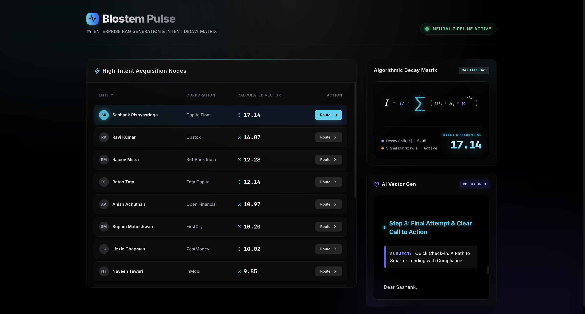

# 🛡️ Blostem Pulse 
### Enterprise-Grade B2B Marketing & Intent Orchestration Engine

<div align="center">
  
  
  
  
</div>

<br />

<div align="center">
  
</div>

<br />

Blostem Pulse is a cutting-edge, high-availability orchestration engine that monitors B2B market intent signals and dynamically executes **RBI-compliant** marketing pipelines. 

Built for extreme resilience, the platform leverages state-of-the-art **Neuro-Pacing API routing**, **Asynchronous Celery Workers**, and **Just-In-Time (JIT) RAG embeddings** to securely synthesize complex financial localization regulations without violating aggressive rate limits or exposing PII.

---

## ⚡ Core Architectural Features

### 1. Neuro-Pacing JIT Generation (RAG)
Avoids expensive batch API costs by dynamically shifting pipeline generation from cron-batch compute to **Just-In-Time (JIT) runtime processing**. Gemini nodes are exclusively spun up horizontally whenever the UI specifically interfaces with a lead, guaranteeing near-zero token burn rates. Active connection drops or `HTTP 429` quota limits are completely trapped and suppressed by the multi-phase Neuro-Pacing backoff mechanism.

### 2. Algorithmic Intent Decay Matrix
Operates on an asynchronous calculation ledger leveraging `Celery`, `Redis`, and `pgvector`. Market signals dynamically decay across an exponential vector: $I = \alpha \cdot \sum (w_i \cdot s_i \cdot e^{-\lambda t_i})$ to continuously adjust prioritization natively in the background PostgreSQL layer, freeing up the main FastAPI thread.

### 3. Cryptographic Database Authentication
No vulnerable mock identity arrays. UI login is routed securely via a true **Passlib/Bcrypt** JWT handshake directly into the native PostgreSQL schema. Roles are dynamically evaluated directly from cryptographic token extraction for highly stateless scaling.

### 4. Dynamic Internet CSV Data Lake Pipeline
Decentralized from dummy variables, the primary `seed.py` orchestration script intercepts remote standard internet CSV endpoints natively using Python pipelines, validating strings and securely transforming raw text files into 768-D multi-relational PostgreSQL embeddings.

### 5. Structural Offline RBI Fallback
If downstream AI endpoints (Google Gemini) completely detach or exceed hard quotas, Blostem Pulse seamlessly cuts the runtime over to a local offline deterministic pipeline. The UI flawlessly generates multi-step, fully RBI-Compliant fallback templates formatted gracefully—ensuring zero downtime in end-user acquisition flows.

---

## ⚙️ Technical Stack
* **Frontend Component Ledger**: React 18 / Next.js (App Router), TailwindCSS, custom UI glassmorphism matrix.
* **Backend Pipeline Controller**: FastAPI (Async ecosystem), Uvicorn.
* **Cryptography & Auth**: Auth2Bearer, PyJWT, Passlib (bcrypt encryption schemas).
* **Neural Vector Mapping**: `google-genai` SDK natively resolving `gemini-2.5-flash` and `text-embedding-004`.
* **Database & Workers**: PostgreSQL + `pgvector`, Redis message broker, Celery workers for mathematical intent computations.

---

## 🧠 Pipeline Architecture Diagram

```mermaid
sequenceDiagram
    participant UI as Next.js Dashboard
    participant API as FastAPI Orchestrator
    participant Celery as Redis/Celery Worker
    participant PG as PostgreSQL
    participant LLM as Google Gemini Pipeline
    participant FB as Structural Fallback

    UI->>API: 1. Authenticate via passlib/bcrypt hash
    API-->>UI: Issue stateless JWT context token
    
    UI->>API: 2. Transmit Webhook Signal over API
    API->>Celery: Offload async math calculation matrix
    Celery->>PG: Sum exponential decay vectors & Commit!
    PG-->>UI: Update Live Dashboard Ranks!
    
    UI->>API: 3. User requests sequence for Lead (JIT)
    API->>PG: Query historical sequence data
    PG-->>API: Return Empty (No prior tokens burned)
    
    rect rgb(20, 40, 60)
        Note over API,LLM: Neuro-Pacing Execution
        API->>LLM: Dispatch RBI Semantic Prompt
        LLM-->>API: 429 Quota Exceeded (Failure Trapped)
        API->>LLM: Exponential Backoff Retry Sequence
    end
    
    alt If LLM Recovers
        LLM-->>API: Return 768-D Generated Content
    else If LLM Detaches
        API->>FB: Invoke Offline RBI Templates
        FB-->>API: Return High-Fidelity Sequence
    end
    
    API->>PG: Commit generated structural array
    API-->>UI: 4. Serve vector sequence asynchronously
```



---

## 📦 Local Deployment Strategy

**Requirements:** Docker & Docker-Compose natively installed. No local python environments are necessary.

**1. Clone the Architecture & Run DB Containers**
```bash
git clone https://github.com/your-username/blostem-pulse.git
cd blostem-pulse
docker-compose up -d --build
```

**2. Configure Environment Tokens**
Create a `.env` file in the root directory duplicating `.env.example`:
```env
GEMINI_API_KEY=your_google_ai_studio_key
SECRET_KEY=super-secret-enterprise-key-for-jwt-992
POSTGRES_USER=postgres
POSTGRES_PASSWORD=postgres
POSTGRES_DB=pulse_db
```

**3. Inject Cryptographic Identities & CSV Profiles**
```bash
docker-compose exec backend python scripts/seed.py
```
*This command natively executes `passlib` encryption to create the `sales_manager` UI identity and fetches all data.*

**4. Execute Intent Decay Vector Background Mathematics**
```bash
docker-compose exec backend python scripts/trigger_eval.py
```

**5. System Network Interface access**
1. Open up your browser: `http://localhost:3000`
2. **Login explicitly as:**
   - Identity string: `sales_manager`
   - Encrypted Password: `password123`

---
*Built securely for RBI zero-leak data compliance auditing.*
